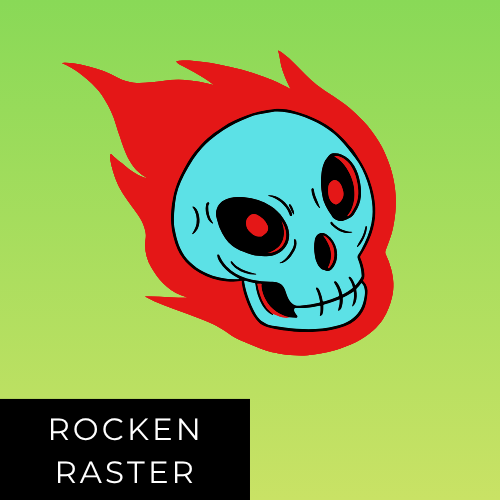

  

    
<strong>Rocken Raster</strong> is a <strong>CPU-based Software Rasterizer</strong> designed to render <strong>3D scenes</strong>.

    
It supports modern rendering techniques, including <strong>Triangle Rasterization</strong>, <strong>Depth Testing</strong>, <strong>Basic Shading</strong>, and more — all built from scratch.

    
The <strong>Walnut Framework</strong> is used for basic operations such as <strong>Window Creation</strong>, <strong>UI</strong>, and the <strong>GLM Math Library</strong>.

  

  

    
  

---

## 🐉 Features

- Custom **OBJ Mesh** and **Texture Loading**  
- **3D Rasterization** with support for both **Orthographic** and **Perspective projection**  
- Multiple **Culling Techniques**: *Backface Culling*, *Depth Test Culling*, and *Clip Space Culling*  
- **Scene Creation** with multiple objects  
- **Camera Controls**: *Movement*, *Rotation*, *Panning*, *Zooming*, *Camera Speed* (supports both Orthographic and Perspective)  
- **Material system** supporting both *Texture-based* and *Color-based* rendering

## 🖼️ Rendering Pipeline

**Model → World → View → Clip → NDC → UV → Pixel**

## 🧭 Conventions

- **Coordinate Convention**: *Right-Handed*  
   - Left → Right = **+X**  
   - Bottom → Top = **+Y**  
   - Camera → Screen = **–Z**  

- **Triangle Winding Convention**: *Counter Clockwise (CCW)*

## 👽 Future Plans

- Improved **Clip Space Culling** with *Retriangulation* instead of full triangle discard  
- **Physically Based Rendering (PBR)** material system  
- **Ray-traced Shadows**  
- **Volumetric Fog**  
- **Particle System** (e.g., smoke, fire)  
- **DLSS-like Super-resolution** system  
- **GPU Hardware Acceleration**  
- General **Performance Optimization**
