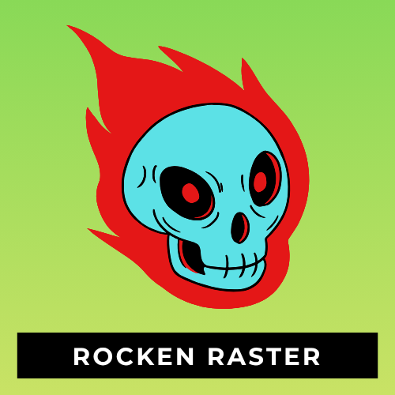

# **Rocken Raster - A CPU Rasterizer**

* **Rocken Raster** is a **CPU-based Software Rasterizer** designed to render **3D scenes**.
* I built the **Rasterizer** to learn more about various **Rasterizing** and **Graphics** concepts.
* It supports many modern rendering techniques, including **Triangle Rasterization**, **Depth Testing**, **Culling**, **Projections**, **Baking**, and more all built from scratch.
* **Rocken** has a basic **Audio System Implementation** as well.
* The **Walnut Framework** is used for basic operations such as **Window Creation**, **UI**, and the **GLM Math Library**.

## 📺 **Demo**

## 🐉 **Available Features**

- Custom **OBJ Mesh** and **Texture Loading**  
- **3D Rasterization** with support for both **Orthographic** and **Perspective projection**  
- Multiple **Culling Techniques**: **Backface Culling**, **Depth Test Culling**, and **Clip Space Culling**  
- **Scene Creation** with **Multiple Objects**  
- **Camera Controls** like **Movement**, **Rotation**, **Panning**, **Zooming**, and **Camera Speed**
- Different **View Modes** such as **Lit**, **Unlit**, **Triangulate**, **Depth**, and **Normal**  
- **Material System** supporting both **Texture-based** and **Color-based** rendering  
- Concept of **Static** and **Movable** objects  
- Automatic **View, Projection, & Transform Baking** for **Camera** and **Entities** for **Optimisations**  
- **Exponential Fog** entity that blends with the **Sky Color** based on **Distance** and **Fog Falloff** value
- A basic **Directional Light** that **Illuminates** meshes from the direction of **Light**
- **User Interface** tabs and buttons to **Load** and **Configure** different **Scenes** in **Run-time**
- **OpenAL** based **Audio System** with **Source** and **Listener** components

## 🛠️ **Currently Working On**

- **Multi-threading** for faster rendering
- Branch - [multi-threading](https://github.com/munucrafts/Rocken-Raster/tree/multi-threading)

## 🚧 **Planned Features**

- **Skeletal Animation** and **Skinning**
- **DLSS-like Super-Resolution**
- **Physically Based Rendering (PBR)**
- **Ray-Traced Shadows**
- Improved **Clip Space Culling** with **Retriangulation**
- **Particle System**

## 🖼️ **Rendering Pipeline**
   - **Model → World → View → Clip → NDC → UV → Pixel**
 
## 🧭 **Conventions**

- **Coordinate Convention** (**Right-Handed**)  
   - Left → Right = **+X**  
   - Bottom → Top = **+Y**  
   - Camera → Screen = **–Z**

- **Triangle Winding Convention**: **Counter Clockwise (CCW)**

## 🤖 **How to Build**

- Project Directory → Scripts → Run Setup.bat
